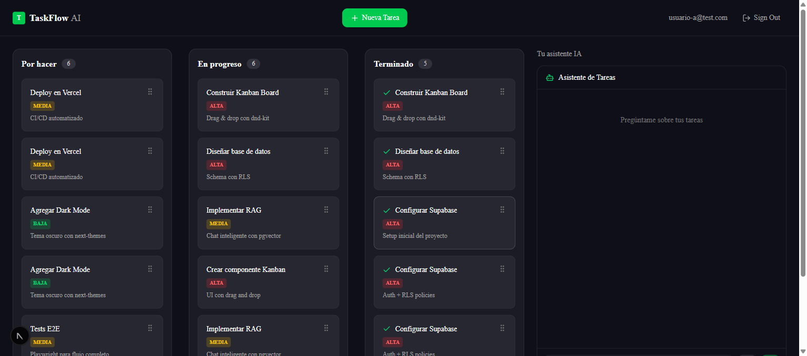
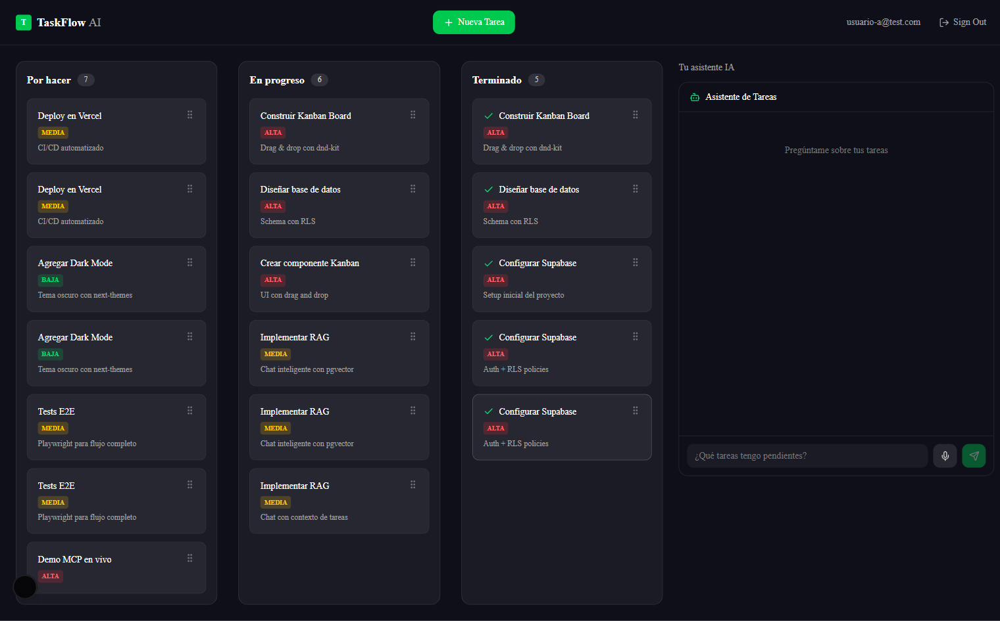

# TaskFlow AI

> Tablero Kanban inteligente con asistente de IA conversacional, búsqueda semántica (RAG) y dictado por voz.

[](https://github.com/gabo2607/taskflow-ai/actions/workflows/ci-cd.yml)
[](https://taskflow-ai.vercel.app)
[](https://nextjs.org)
[](https://www.typescriptlang.org)
[](https://supabase.com)

---

## Screenshots

| Dashboard Kanban | Chat con IA |
|---|---|
|  |  |

---

## Tech Stack

| Capa | Tecnología |
|---|---|
| Framework | Next.js 15 (App Router) + React 19 |
| Lenguaje | TypeScript strict |
| Base de datos | Supabase (PostgreSQL + pgvector) |
| Auth | Supabase Auth (SSR) |
| IA / Chat | Anthropic Claude (claude-sonnet-4-5) |
| Embeddings | Voyage AI (voyage-3.5, 1024 dims) |
| Voz | Web Speech API (Chrome, `es-ES`) |
| LLM alternativo | Groq |
| UI | Tailwind CSS v4 + Shadcn/ui |
| Drag & Drop | dnd-kit |
| Tests unitarios | Vitest + jsdom |
| Tests E2E | Playwright (Chromium) |
| Deploy | Vercel |

---

## Setup local

### 1. Clonar el repositorio

```bash
git clone https://github.com/gabo2607/taskflow-ai.git
cd taskflow-ai
```

### 2. Instalar dependencias

```bash
npm install
```

### 3. Variables de entorno

Copia el archivo de ejemplo y rellena los valores:

```bash
cp .env.example .env.local
```

```env
NEXT_PUBLIC_SUPABASE_URL=https://<tu-proyecto>.supabase.co
NEXT_PUBLIC_SUPABASE_ANON_KEY=<anon-key>
ANTHROPIC_API_KEY=<sk-ant-...>
VOYAGE_API_KEY=<pa-...>
GROQ_API_KEY=<gsk-...>
SUPABASE_SERVICE_ROLE_KEY=<service-role-key>

# Solo para tests E2E
TEST_USER_EMAIL=test@example.com
TEST_USER_PASSWORD=supersecret
```

### 4. Migraciones de base de datos

```bash
npx supabase db push
```

### 5. Iniciar el servidor de desarrollo

```bash
npm run dev
```

Abre [http://localhost:3000](http://localhost:3000).

---

## Comandos

```bash
# Desarrollo
npm run dev             # Servidor en localhost:3000

# Producción
npm run build           # Build + type-check
npm run start           # Servidor de producción

# Tests unitarios (Vitest)
npm test                # Ejecución única
npm run test:watch      # Modo watch
npm run test:coverage   # Con cobertura (umbral 20%)

# Tests E2E (Playwright — requiere dev server corriendo)
npm run test:e2e        # Headless
npm run test:e2e:ui     # Modo interactivo

# Calidad de código
npx eslint . --fix      # Lint y auto-fix
npx tsc --noEmit        # Solo type-check

# Deploy manual (Vercel CLI)
vercel                  # Preview
vercel --prod           # Producción
```

---

## Arquitectura RAG

El chat de IA usa **Retrieval-Augmented Generation** para responder preguntas sobre las tareas del usuario:

```
Usuario escribe (o dicta por voz)
        │
        ▼
  embedQuery()          ← Voyage AI convierte la pregunta a vector 1024-dim
        │
        ▼
  match_task_embeddings  ← Supabase RPC: búsqueda coseno en pgvector (HNSW)
  (threshold=0.4, k=8)
        │
        ▼
  Tareas relevantes como contexto
        │
        ▼
  claude-sonnet-4-5     ← Genera respuesta en lenguaje natural
        │
        ▼
  Respuesta al usuario
```

Cuando se crea una tarea, `embedTask()` genera su vector y lo almacena en `task_embeddings` (tabla con RLS habilitado).

---

## CI/CD

El pipeline de GitHub Actions en `.github/workflows/ci-cd.yml` ejecuta dos jobs:

1. **CI** (todas las ramas): lint → type-check → vitest con cobertura → `next build`
2. **deploy-production** (solo `main`, solo si CI pasa): `vercel pull` → `vercel build --prod` → `vercel deploy --prod`

Los secrets necesarios se configuran en **Settings → Secrets and variables → Actions** del repositorio.

---

## Estructura del proyecto

```
taskflow-ai/
├── src/
│   ├── actions/          # Server Actions (getTasks, createTask, chatWithTasks…)
│   ├── app/              # Rutas Next.js App Router
│   │   ├── dashboard/    # Página principal (Kanban + Chat)
│   │   └── login/
│   ├── components/       # Componentes React
│   │   ├── chat/         # UI del chat con IA
│   │   └── ui/           # Shadcn components
│   ├── hooks/            # use-tasks-by-status, use-move-task, use-kanban-dnd
│   ├── lib/              # embeddings, embed-task, supabase clients
│   └── types/            # Task, TaskStatus, TaskPriority
├── e2e/                  # Tests Playwright
├── supabase/migrations/  # SQL migrations (004…006)
├── .github/workflows/    # CI/CD pipeline
└── .env.example
```

---

## Licencia

MIT
